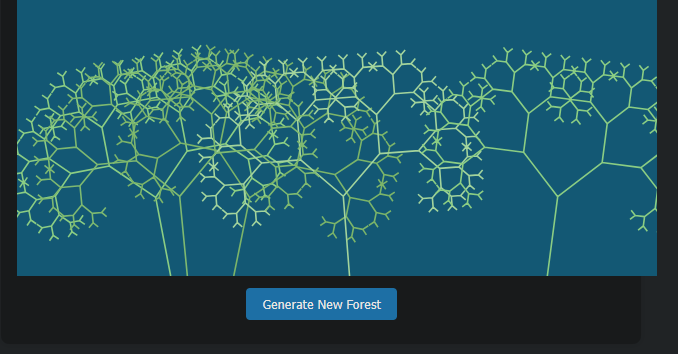

# Fractal Forest Generator 🌳

A beautiful Go web application that generates interactive fractal trees using SVG. Each tree is uniquely generated with different colors and patterns, creating a mesmerizing forest visualization.



## 🌟 Features

- **Interactive Web Interface**: Modern, responsive design with real-time updates
- **Dynamic Tree Generation**: Each tree is uniquely generated with:
  - Random positioning
  - Natural color variations
  - Fractal branching patterns
- **Real-time Updates**: Generate new forests with a single click
- **Production Ready**: Includes health checks and proper error handling
- **Containerized**: Easy deployment with Docker support

## 🛠️ Technical Stack

- **Backend**: Go 1.21+
- **Frontend**: HTML5, CSS3, JavaScript
- **Graphics**: SVG for vector-based rendering
- **Container**: Docker
- **Deployment**: DigitalOcean App Platform

## 🚀 Getting Started

### Prerequisites

- Go 1.21 or later
- Docker (optional, for containerized deployment)
- Git

### Local Development

1. Clone the repository:
```bash
git clone https://github.com/yourusername/fractal-forest.git
cd fractal-forest
```

2. Run the application:
```bash
go run fractal_forest.go
```

3. Visit `http://localhost:8080` in your browser

### Docker Development

```bash
# Build the image
docker build -t fractal-forest .

# Run the container
docker run -p 8080:8080 fractal-forest
```

## 📦 Deployment

### DigitalOcean App Platform

1. Create a new app in DigitalOcean App Platform
2. Connect your GitHub repository
3. Select the Dockerfile deployment method
4. Configure the following:
   - HTTP Port: 8080
   - Health Check Path: /health
   - Instance Count: 1 (or more for scaling)
   - Instance Size: Basic (or your preferred size)

### Environment Variables

| Variable | Description | Default |
|----------|-------------|---------|
| `PORT` | Application port | 8080 |

## 🔍 API Endpoints

| Endpoint | Method | Description |
|----------|--------|-------------|
| `/` | GET | Main web interface |
| `/forest` | GET | Generates SVG forest |
| `/health` | GET | Health check endpoint |

## 🏗️ Architecture

The application follows a simple but effective architecture:

1. **Web Server**: Handles HTTP requests and serves the application
2. **Tree Generator**: Creates fractal trees using recursive algorithms
3. **SVG Renderer**: Converts tree data into SVG graphics
4. **Frontend**: Provides interactive user interface

## 🧪 Testing

Run the test suite:

```bash
go test
```

## 🤝 Contributing

1. Fork the repository
2. Create your feature branch (`git checkout -b feature/amazing-feature`)
3. Commit your changes (`git commit -m 'Add amazing feature'`)
4. Push to the branch (`git push origin feature/amazing-feature`)
5. Open a Pull Request

## 📝 License

This project is licensed under the MIT License - see the [LICENSE](LICENSE) file for details.

## 🙏 Acknowledgments

- Inspired by fractal geometry and natural tree patterns
- Built with Go's standard library
- Deployed on DigitalOcean App Platform

## 📫 Contact

Project Link: [https://github.com/karmek-k/fractal-forest](https://github.com/karmek-k/fractal-forest) 